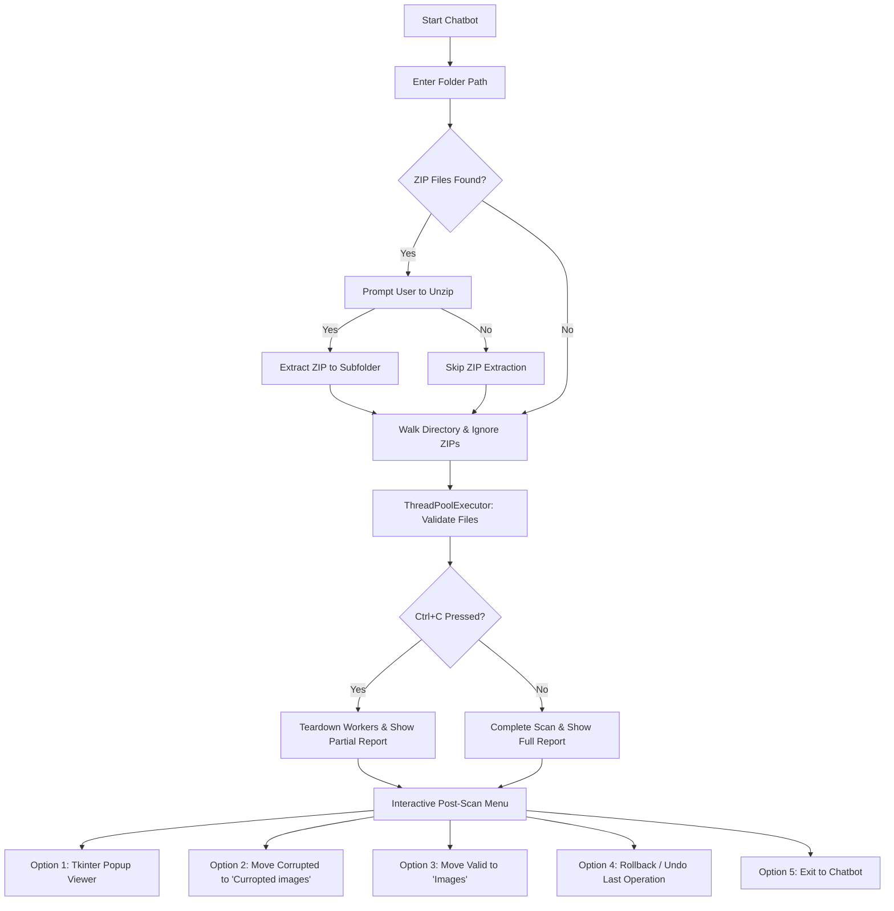

# Third Eye AI — Fast Image Dataset Scanner & Chatbot

```
  _____ _   _ ___ ____  ____      _______   _______
 |_   _| | | |_ _|  _ \|  _ \   | ____\ \ / / ____|
   | | | |_| || || |_) | | | |  |  _|  \ V /|  _|  
   | | |  _  || ||  _ <| |_| |  | |___  | | | |___ 
   |_| |_| |_|___|_| \_\____/   |_____| |_| |_____|
```
> **AI-Powered Image Dataset Scanner** | *Never stops. Always scans. Always keeps your datasets clean.*

---

## ◉ Table of Contents
1. [Overview](#-overview)
2. [Architecture & Workflow](#-architecture--workflow)
3. [Key Features](#-key-features)
4. [Supported Formats & Magic Bytes](#-supported-formats--magic-bytes)
5. [Installation & Setup](#-installation--setup)
6. [Interactive Menu Workflow](#-interactive-menu-workflow)
7. [Post-Scan Actions (Move, Separate & Undo)](#-post-scan-actions-move-separate--undo)
8. [License](#-license)

---

## ◉ Overview
**Third Eye AI** is a lightweight, standalone terminal chatbot and blazing-fast image dataset scanner. It traverses directory trees to analyze, classify, and filter images before training machine learning models. 

Unlike heavy pipelines that decode entire pixel grids or allocate massive GPU memory, Third Eye AI validates images using **file signature (magic bytes) matching** and **extension validation**. It scans hundreds of thousands of files in seconds, detects corrupted headers and non-image files, and offers a suite of directory-organization tools with a multi-step rollback/undo mechanism.

---

## ◉ Architecture & Workflow

Here is how the scanning and post-scan workflow operates:



---

## ◉ Key Features

- ⚡ **Ultra-Fast Signature Checks (No TensorFlow/Pillow Decode Overhead)**
  Checks only file headers (first 12 bytes) to verify format integrity, skipping slow pixel decompression.
- 📂 **Recursive Directory Crawler**
  Walks deep directory structures, discovering all files, while safely filtering out hidden OS files (`desktop.ini`, `thumbs.db`, `.DS_Store`).
- 🤐 **Automatic ZIP Discovery**
  Detects `.zip` archives recursively, prompts you to extract them into dedicated subfolders before scanning, and ignores original zip files during the validation phase.
- ✕ **Tkinter Popup Viewer**
  Clicking `[View]` in the report tables opens a native window containing the image with a custom blue `✕ Close Image` button.
- ↩️ **Unlimited Rollbacks (Undo)**
  Records the history of all directory restructuring actions during a session. Allows you to undo moves, restores files to original directories, and automatically deletes empty folders.
- 🛑 **KeyboardInterrupt Resilience**
  Pressing `Ctrl+C` halts scanning immediately and safely without losing progress, displaying the report of files scanned up to that moment.

---

## ◉ Supported Formats & Magic Bytes

The tool checks the extension and cross-references it with the official file signatures (magic bytes):

| Format | Supported Extensions | Expected Magic Bytes (Hex / ASCII) |
| :--- | :--- | :--- |
| **JPEG** | `.jpg`, `.jpeg` | `FF D8` |
| **PNG** | `.png` | `89 50 4E 47 0D 0A 1A 0A` (or `\x89PNG\r\n\x1a\n`) |
| **GIF** | `.gif` | `GIF87a` or `GIF89a` |
| **BMP** | `.bmp` | `BM` |
| **WEBP** | `.webp` | Starts with `RIFF` and contains `WEBP` at byte 8 |
| **TIFF** | `.tiff`, `.tif` | `II * \x00` (Little Endian) or `MM \x00 *` (Big Endian) |
| **ICO** | `.ico` | `00 00 01 00` |
| **PPM/PGM** | `.ppm`, `.pgm` | `P1` through `P7` |

*Files with missing extensions, non-image extensions (like `.txt`, `.csv`, `.json`), or mismatched headers are marked as **Corrupted**.*

---

## ◉ Installation & Setup

### Prerequisites
- Python 3.8 or higher.
- `Pillow` (for popup viewer) and `rich` (for terminal rendering).

### Installation
Clone the repository and install the dependencies:
```powershell
git clone https://github.com/Varshith10121901/Images-Scanner-Before-Model-Training.git
cd Images-Scanner-Before-Model-Training
pip install rich pillow
```

### Running the App
Start the interactive terminal chatbot:
```powershell
python third_eye.py
```

---

## ◉ Interactive Menu Workflow

Upon startup, the chatbot welcomes you. Paste any folder path to begin:

1. **ZIP Detection**:
   If zip archives are found, the chatbot will ask:
   ```text
   ⚠  Found 1 zip file(s) in the directory.
     • datasets/raw_images.zip
     Do you want to unzip this file? (y/n) › 
   ```
2. **Scan Report**:
   Once scanning finishes, it outputs a beautiful, color-coded health summary:
   ```text
   ╭─────────────────────────── Third Eye — Image Health Score ───────────────────────────╮
   │  Directory  : D:\leaf_dataset                                                        │
   │  Scanned at : 2026-06-27  15:31:00                                                   │
   │                                                                                      │
   │  Score      :  125009 / 126859  images OK  •  1850 corrupted                         │
   │  Health     :  ||||||||||||||||||||||||||||||||||||||||  98.5%                       │
   │                                                                                      │
   │  ✓  Good Images :   125,009                                                          │
   │  ✗  Corrupted   :     1,850                                                          │
   │     Scanned     :   126,859                                                          │
   │  Corruption Rate :  1.46%                                                            │
   ╰──────────────────────────────────────────────────────────────────────────────────────╯
   ```

---

## ◉ Post-Scan Actions (Move, Separate & Undo)

After displaying the scan results, the tool opens the **Post-Scan Action Menu**:
```text
  Post-Scan Actions
  ────────────────────────────────────────────────────────────────────────────────
    1. View a file from the report (opens popup)
    2. Move corrupted files to 'Curropted images' folder
    3. Separate images (move valid images to 'Images' folder)
    4. Rollback / Undo last move operation
    5. Done (return to chatbot)
```

- **Option 1 (View File)**:
  Enter the index number (e.g. `3` or `v5`) or filename to display the image. A native window pops up with the image and a blue `✕ Close Image` button.
- **Option 2 (Move Corrupted)**:
  Moves all files classified as `corrupted` into a new folder named `Curropted images` inside the scanned directory.
- **Option 3 (Separate Images)**:
  Moves all valid images into a new folder named `Images` inside the scanned directory, leaving non-image files and other content safely in the root.
- **Option 4 (Rollback / Undo)**:
  Undo the last move operation. Restores all files back to their original paths and cleans up empty directory structures created by the move actions.
